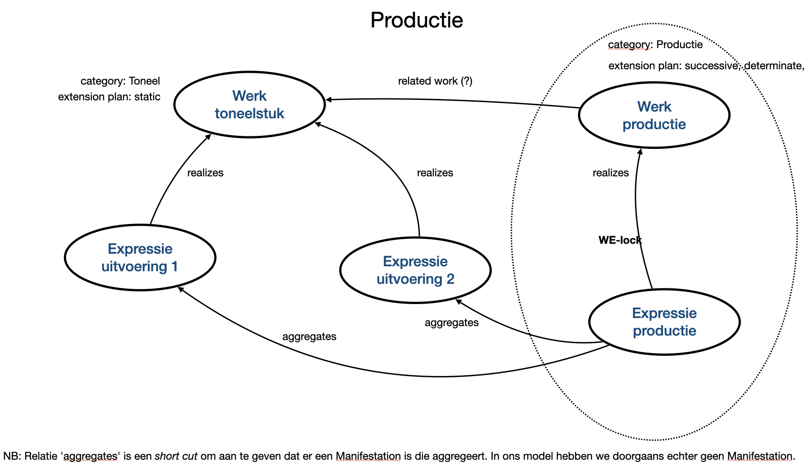
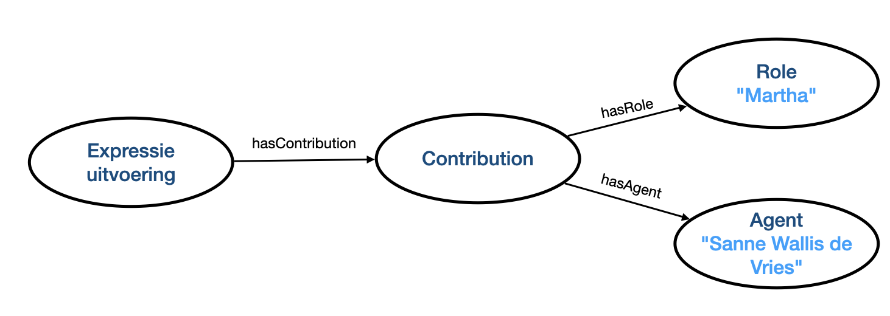

# RDA-Applicatieprofiel Podiumkunst

*versie 1.1 '**work in progress**' / [Podiumkunst.net](https://podiumkunst.net/) / 2024-05-15* 

## Inleiding
RDA, _Resource Description and Access_, is een pakket van data-elementen, richtlijnen en instructies voor het maken van metadata voor bibliotheken en erfgoedinstellingen, die voldoen aan internationale modellen voor gebruikersgerichte linked data-applicaties. De RDA-standaard biedt veel keuzemogelijkheden bij de toepassing ervan. Om in de praktijk met RDA te kunnen werken is het van belang die keuzes te maken en vast te leggen in een zogeheten **applicatieprofiel** (ook wel **toepassingsprofiel**).

Het applicatieprofiel geeft aan welke entiteiten gebruikt worden (en welke niet), welke elementen verplicht of optioneel zijn (of juist niet gebruikt worden), welke registratiemethoden toegestaan (of verplicht) zijn, welke terminologiebronnen bij welke elementen gebruikt kunnen worden, etc. Dit document is daarmee gericht op metadataspecialisten, bijvoorbeeld  die betrokken zijn bij de inrichting van een catalogiseerapplicatie of collectiebeheersysteem. Er wordt van hen daarbij elementaire kennis van linked data-principes en -praktijk verwacht. Nadrukkelijk is dit toepassingsprofiel **niet** bedoeld voor catalogiseerders of personen in een vergelijkbare functie.

Het RDA-applicatieprofiel Podiumkunst richt zich op het verbinden van collecties van verschillende omvang, inhoud en volwassenheid in het domein van de podiumkunsten. In lijn met de [Digitaal Erfgoed Referentie Architectuur](https://netwerkdigitaalerfgoed.nl/activiteiten/dera/) (DERA) van het Netwerk Digitaal Erfgoed (NDE) wordt het fundament daarvan gevormd door **linked data**-principes. De **RDA**-standaard is gekozen als basis voor de datamodellering en voor het beschrijven van de collecties. RDA biedt verschillende scenario's voor implementatie, voor deze toepassing is het Linked Open Data-scenario (implementatiescenario A) relevant.

Door in het domein van de podiumkunsten met een gedeeld applicatieprofiel te werken, kunnen beschrijvingen van verschillende collecties op elkaar aangesloten worden. Het applicatieprofiel maakt het mogelijk te komen tot één gedeelde, organisatie- en collectieoverstijgende, linked data-graaf. Dit biedt veel voordelen voor uiteenlopende gebruikers van de data, zoals makers in de podiumkunsten, onderzoekers, geïnteresseerde leken of bouwers van een app.

Dit RDA-applicatieprofiel voor de podiumkunsten is een initiatief van [Podiumkunst.net](https://podiumkunst.net/). Het is werk-in-uitvoering, een levend document. Het applicatieprofiel doet in deze vorm *(vrijwel) geen uitspraken* over de te kiezen terminologiebronnen voor waardenlijsten of thesauri. Een advies over gezamenlijk te hanteren terminologiebronnen is in voorbereiding.

Linked data- en semantischweb-representaties van de entiteiten, elementen en waardenlijsten in RDA zijn beschikbaar via de [RDA Registry](http://www.rdaregistry.info/), de volledige tekst met alle richtlijnen en instructies is beschikbaar via de [RDA Toolkit](https://www.rdatoolkit.org/).

Aan dit applicatieprofiel hebben meegewerkt: *Sylvia Alting van Geusau ([Amsterdamse Hogeschool voor de Kunsten](https://ahk.nl/)), Eric van Balkum ([Muziekschatten](https://www.muziekschatten.nl/)), Sita Bhagwandin ([Koninklijke Bibliotheek](https://kb.nl/)), Remco de Boer ([ArchiXL](https://archixl.nl)), Thomas Op de Coul (Beeld & Geluid / [Muziekweb](https://muziekweb.nl/)), Mirjam Verloop ([Podiumkunst.net](https://podiumkunst.net/)), René Voorburg ([Podiumkunst.net](https://podiumkunst.net/)), Meta van der Waal-Gentenaar ([Koninklijke Bibliotheek](https://kb.nl/)) en Lian Wintermans (zelfstandig muziek- en informatiespecialist, voorzitter [RDA-Commissie](https://rdacommissie.home.blog/)).*

## Gehanteerde principes
Een applicatieprofiel biedt een weloverwogen inperking of verfijning van een bestaande standaard. De principes achter dit profiel gericht op de toepassing van de RDA-standaard binnen het domein van de podiumkunsten worden [hier beschreven](Principles.md).

## Toepassingsprofiel als spreadsheet
De bouwstenen voor het gebruik van RDA zijn de **entiteiten** en de **elementen** die *eigenschappen* of *relaties* vertegenwoordigen. Als basis voor dit toepassingsprofiel is daarom eerst, op basis van de [principes](Principles.md), bepaald welke elementen toe te passen en welke juist niet. Dit is vastgelegd in een [spreadsheet](./assets/RDA-AP_Podiumkunst-net.xlsx) volgens deze [aanpak](Spreadsheet.md).

Het spreadsheet geeft voor de belangrijkste RDA-entiteiten (werk, expressie, manifestatie en item) per element aan of het binnen dit toepassingsprofiel verplicht, aanbevolen, optioneel of juist niet gebruikt moet worden (MoSCoW) en welke registratiemethoden voor dat element verplicht, aanbevolen, optioneel of niet toegestaan zijn. In een later stadium zullen profielen voor de andere entiteiten toegevoegd worden.

Verder wordt er, in lijn met RDA, onderscheid gemaakt tussen verschillende niveaus van beschrijving: de *minimale beschrijving*, de *coherente beschrijving* en de *effectieve beschrijving* (zie ook de [principes](Principles.md)).

* [Lees meer over de gevolgde aanpak](Spreadsheet.md)
* [Download het spreadsheet](./assets/RDA-AP_Podiumkunst-net.xlsx)

## Voorbeeldbeschrijvingen in RDA
Naast het spreadsheet biedt dit applicatieprofiel voorbeelden en toelichtingen. Deze voorbeelden dienen zowel ter illustratie van het spreadsheet, als ook ter aanvulling. De voorbeelden zijn door de muziek- en theaterexperts uit de werkgroep aangedragen. Ze laten zien hoe bepaalde materialen maximaal verbonden en beschreven kunnen worden volgens RDA. In een later stadium zullen varianten op de voorbeelden toegevoegd worden die illustreren hoe minder gedetailleerd ontsloten collecties beschreven kunnen worden. 

Zie de [voorbeeldbeschrijvingen](rdf/examples).

## Code-fragmenten
In aanvulling op de voorbeeldbeschrijvingen biedt dit applicatieprofiel ook enige code-fragmenten. Dit zijn kleine, praktische stukjes RDF, om te helpen bij het zelf opbouwen van een beschrijving in RDA in lijn met dit profiel. Ze zijn nadrukkelijk *niet* bedoeld voor bijvoorbeeld catalogiseerders, wel voor degenen die een catalogiseervoorziening of ETL-proces inrichten.

Zie de [code-fragmenten](rdf/snippets).

## Werk in uitvoering

Actuele aandachtspunten bij de verdere invulling van dit profiel zijn:

### Modellering theaterproducties

Een belangrijk concept bij het beschrijven van theater is de **productie**. De volgende afbeelding schets hoe Podiumkunst.net nu de productie benadert:

De theaterproductie wordt hier gezien als aggregerend *werk*. Het is één-op-één gerelateerd aan de productie als een *expressie* (een zogenaamde *WE-lock*). Uiteraard is er een (nader te benoemen) relatie met het oorspronkelijke theaterwerk dat met deze productie uitgevoerd wordt. De productie zou ook een relatie kunnen hebben met deelwerken die als onderdeel van de productie gezien worden, zoals wellicht het kostuumontwerp.

### Verfijning rollen

RDA biedt veel relaties om rollen van actoren aan te duiden. Toch zal het aantal relaties vaak niet genoeg zijn. Dit kan opgelost worden door subproperties te maken van bestaande RDA-properties. Die aanpak heeft nadelen. Het is omslachtig subproperties te maken en een veelheid aan properties maakt het minder eenvoudig om effectieve zoekvragen te formuleren. Bovendien is er dikwijls de behoefte om specifieke kenmerken te koppelen aan de aard van de bijdrage van een actor aan een bron. Dat kan niet aangegeven worden in de structuur die RDA nu biedt. Het volgende plaatje schetst een model dat meer flexibiliteit biedt in het beschrijven van de rollen van actoren. 

Het voorbeeld laat zien dat de Sanne Wallis de Vries de rol van "Martha" vertolkte. Deze aanpak kan ook gebruikt worden om bijvoorbeeld aan te geven dat een musicus een speciek instrument speelde. In plaats van het definieren van subproperties kunnen hier nieuwe rollen aangemaakt worden door een gebruikte waardelijst uit te breiden. Dit is eenvoudiger en waardenlijsten maken het voor de gebruiker makkelijker om zoekvragen met bijvoorbeeld SPARQL te formuleren.

### Sjablonen

Plan is om met dit toepassingsprofiel uiteindelijk sjablonen aan te bieden die gebruikt kunnen worden als een eenvoudig invulformulier voor het beschrijven van verschillende soorten bronnen. Zie de [aanzet voor de nog uit te werken sjablonen](rdf/templates).

