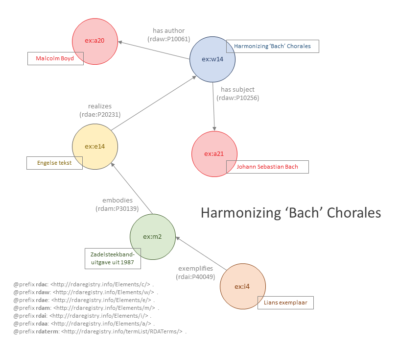

# Harmonizing 'Bach' chorales

Bestand: [02_harmonizing-bach.ttl](02_harmonizing-bach.ttl)

## De resource

_Harmonizing 'Bach' chorales_ is een beknopt boekje voor muziekstudenten, dat veel gebruikt is als lesboek bij het vak harmonieleer. Het stamt uit 1967 en is diverse keren heruitgegeven, soms in combinatie met _Bach's instrumental counterpoint_ van dezelfde auteur. In dit voorbeeld is uitgegaan van de zadelsteekbanduitgave uit 1987 in het bezit van één van de werkgroepleden.

## Entiteitenstructuur

Dit voorbeeld laat in de eerste plaats de primaire relaties tussen een werk, expressie, manifestatie en item zien. Deze relaties zijn verplicht om tot een _coherente beschrijving_ te komen

Het voorbeeld toont hoe een concreet item (hier geïdentificeerd met de compacte IRI **ex:i4**) een manifestatie (hier geïdentificeerd als **ex:m2**) voorstelt. Deze manifestatie representeert alle items met dezelfde (oorspronkelijke) eigenschappen als het item in dit voorbeeld.
Dit zal catalografen vertrouwd voorkomen: aan de hand van een concreet exemplaar beschrijf je een publicatie.

De manifestatie verwezenlijkt een expressie (hier geïdentificeerd als **ex:e14**), die op zijn beurt een werk (hier geïdentificeerd als **ex:w14**) realiseert. Zowel expressie als werk hebben betrekking op de meer inhoudelijke aspecten van de resource, zoals (in dit voorbeeld) de aard van de inhoud (tekst), de taal (Engels), de auteur (Malcolm Boyd) en het onderwerp (Johann Sebastian Bach).

## Representatie in RDA-RDF

{tekstje waarin wat toelichting op de RDA-RDF gegeven wordt} 

Bestand: [02_harmonizing-bach.ttl](02_harmonizing-bach.ttl)
