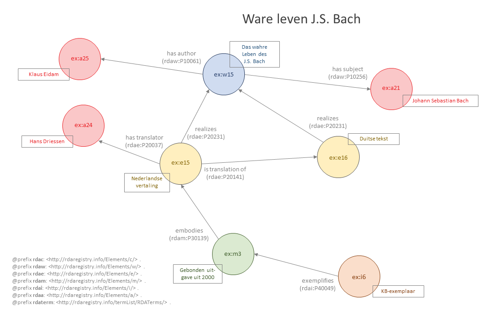

# Het ware leven van Johann Sebastian Bach

Bestand: [03_ware-leven-bach-2.ttl](03_ware-leven-bach-2.ttl)

## De resource

_Het ware leven van Johann Sebastian Bach_ verscheen oorspronkelijk in het Duits in 1999, de Nederlandse vertaling kwam uit in 2000. Dit voorbeeld gaat uit van het KB-exemplaar van de gebonden uitgave uit 2000. Gegevens over de oorspronkelijke versie zijn toegevoegd op basis van het colofon in de Nederlandse editie. Er zijn meer vertalingen (o.a. een Engelse en een Spaanse), maar die hebben we bij het uitwerken van dit voorbeeld buiten beschouwing gelaten.

## Entiteitenstructuur

De primaire relaties gaan in dit voorbeeld van item **ex:i6** naar manifestatie **ex:m3** naar expressie **ex:e15** naar werk **ex:w15**. We weten dat er tenminste één andere expressie is die hetzelfde werk realiseert: de oorspronkelijke Duitse tekst (**ex:e16**). De twee expressies hebben ook een onderlinge relatie: de ene (**ex:e15**) is een vertaling van de andere (**ex:e16**). Deze relatie (**rdae:P20141**) maken we expliciet, omdat hij niet vanzelfsprekend volgt uit het feit dat beide expressies hetzelfde werk realiseren.

Uiteraard bestaat er ook tenminste één manifestatie die de oorspronkelijke Duitse tekst verwezenlijkt. Die hebben we bij de uitwerking buiten beschouwing gelaten, omdat we daar op basis van het colofon maar heel weinig over weten ("Uitgave: Piper Verlag GmbH, München").

In dit voorbeeld zien we, naast de relaties tussen werk en actor die ook in [_Harmonizing 'Bach' chorales_](02_harmonizing-bach.md) voorkomen, een maker-relatie tussen een expressie en een actor. Hans Driessen (**ex:a24**) heeft de Nederlandse vertaling gemaakt.

## Representatie in RDA-RDF

{tekstje waarin wat toelichting op de RDA-RDF gegeven wordt} 

Bestand: [03_ware-leven-bach-2.ttl](03_ware-leven-bach-2.ttl)
