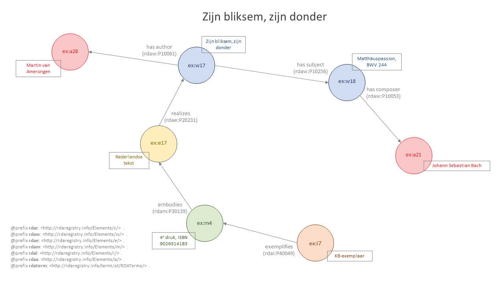

# Zijn bliksem, zijn donder

Bestand: [04_zijn-bliksem-zijn-donder-2.ttl](04_zijn-bliksem-zijn-donder-2.ttl)

## De resource

_Zijn bliksem, zijn donder_ is een cultuurhistorisch essay over de Mattheus-Passie van Johann Sebastian Bach en over de Nederlandse voorliefde voor dat werk. Het verscheen voor het eerst in 1997 en is meerdere keren herdrukt. De 6e druk uit 1999 is een herziene druk. Dit voorbeeld gaat uit van de vierde druk, waarvan een exemplaar aanwezig is in het depot van de Koninklijke Bibliotheek.

## Entiteitenstructuur

Dit voorbeeld gaat niet zozeer over de primaire relaties (item **ex:i7** stelt manifestatie **ex:m4** voor, die expressie **ex:e17** verwezenlijkt, die werk **ex:w17** realiseert), maar wil laten zien dat een werk ook een ander werk als onderwerp kan hebben. Het werk-als-onderwerp is hier de Mattheus-Passie (**ex:w18**) van J.S. Bach (**ex:a21**). Merk op dat Bach, net als in [_Harmonizing 'Bach' chorales_](02_harmonizing-bach.md) en [_Het ware leven van Johann Sebastian Bach_](03_ware-leven-bach-2.md), gerelateerd is aan het primaire werk in het voorbeeld. In dit geval niet rechtstreeks, maar als componist van de Mattheus-Passie.

Uiteraard is de Mattheus-Passie (**ex:w18**) op zijn beurt op vele manieren gerealiseerd. Er zijn talloze genoteerde en uitgevoerde expressies van de muziek, die op hun beurt weer verwezenlijkt zijn in heel veel verschillende manifestaties. In dit voorbeeld zijn die allemaal buiten beschouwing gelaten.

## Representatie in RDA-RDF

{tekstje waarin wat toelichting op de RDA-RDF gegeven wordt} 

Bestand: [04_zijn-bliksem-zijn-donder-2.ttl](04_zijn-bliksem-zijn-donder-2.ttl)
