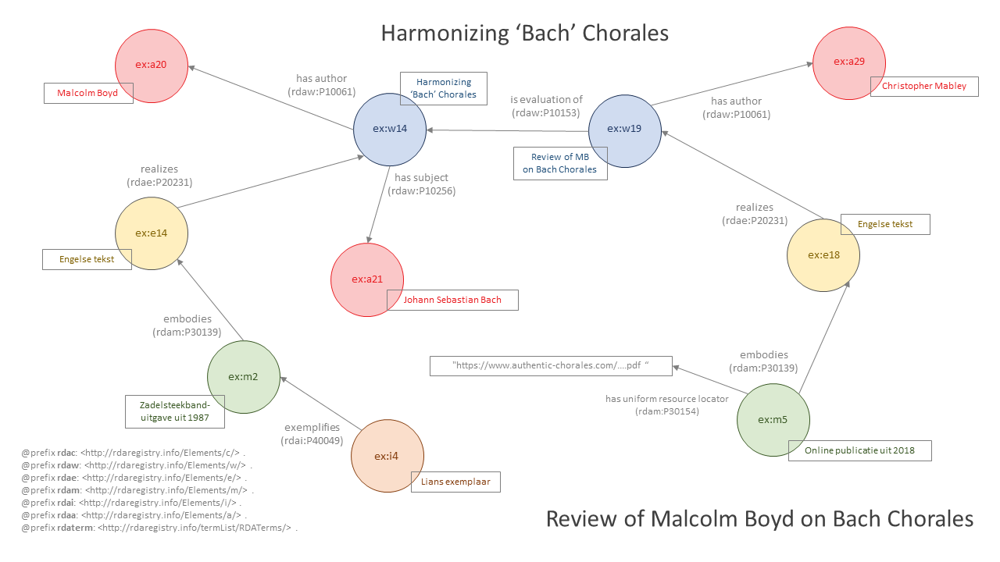

# Review van "Harmonizing 'Bach' chorales"

Bestand: [05_review-harmonizing-bach.ttl](05_review-harmonizing-bach.ttl)

## De bron

_Review of Malcolm Boyd on Bach Chorales_ is een evaluatie van Malcolm Boyds [_Harmonizing 'Bach' chorales_](02_harmonizing-bach.md), 50 jaar na de eerste uitgave ervan. De recensie is online gepubliceerd op de website van de auteur.

## Entiteitenstructuur

De primaire relaties in dit voorbeeld zijn eenvoudig: het werk (**ex:w19**) wordt gerealiseerd door de Engelse tekst (**ex:e18**) die verwezenlijkt wordt door de online uitgave (**ex:m5**). Omdat de manifestatie online beschikbaar is, volstaat voor gebruikers de URL om toegang tot de resource te verkrijgen. Een item wordt daarom niet geïdentificeerd.

Om de relatie tussen de twee werken vast te leggen gebruiken we niet "has subject" (**rdaw:P10256**) zoals in [_Zijn bliksem, zijn donder_](04_zijn-bliksem-zijn-donder-2.ttl), maar het specifiekere sub-element "is evaluation of" (**rdaw:P10153**).

## Representatie in RDA-RDF

Een specifieke typering is toegevoegd om aan te geven dat de resource een "recensie" is:

    rdaw:P10004 <http://id.loc.gov/authorities/genreForms/gf2014026168> ; # has category of work: review (form)

Voor een toelichting op de typeringen zie [_Harmonizing 'Bach' chorales_](02_harmonizing-bach.md#representatie-in-rda-rdf).

De URL naar de online resource wordt als volgt vastgelegd:

    rdam:P30154 "https://www.authentic-chorales.com/filemanager/Review-of-Malcolm-Boyd-on-Bach-Chorales_1.pdf" ; # has uniform resource locator

Bestand: [05_review-harmonizing-bach.ttl](05_review-harmonizing-bach.ttl)
