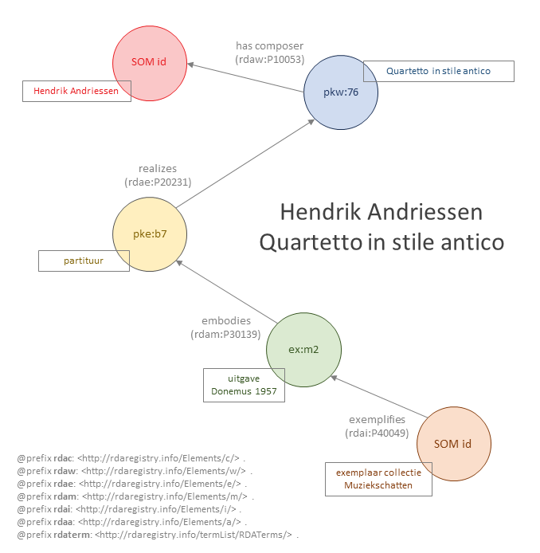

# Quartetto in stile antico

Bestand: [06_quartetto-in-stile-antico.ttl](06_quartetto-in-stile-antico.ttl)

## De bron

De in RDA bescbreven bron betreft bladmuziek uit de collectie van [Muziekschatten](https://www.muziekschatten.nl/compositie?uri=https://data.muziekschatten.nl/som/24793), in door Hendrik Andriessen gecomponeerde kamermuziek.

De beschrijving is niet perfect en weerspiegelt daarmee dat praktische beperkingen bij het omzetten van een catalogusgrecord naar een linked data-structuur bestaan.

## Entiteitenstructuur

De bron wordt op drie niveaus beschreven, als werk (de compositie van Hendrik Andriessen), als expressie (de specifieke muzikale inhoud) en als manifestatie (de op papier uitgegeven bladmuziek). In deze beschrijving wordt geen item (/exemplaar) beschreven.

In deze beschrijving wordt naar componist verwezen aan de hand van de URI voor deze persoon binnnen Muziekschatten. 

## Representatie in RDA-RDF

In de beschrijving van het werk geeft `rdaw:P10004` aan dat het een muziekwerk betreft. Er zou hier ook, via een andere terminologiebron, voor een specifiekere categorie gekozen kunnen worden. De beschrijving van de expressie geeft met `rdae:P20001` aan dat het hier om een uitdrukking in notenschrift gaat. 

Bemerk dat de in de RDF de uitgever van de bladmuziek als een `rdfs:literal` is opgenomen. Idealiter wordt hier ook voor een actor-entiteit gekozen maar in deze fase was de brondata daarvoor nog onvoldoende genormaliseerd. De plaats van uitgifte is wel genormaliseerd tot een -hier niet opgenomen - plaatsentiteit.

Zie bestand: [06_quartetto-in-stile-antico.ttl](06_quartetto-in-stile-antico.ttl)
