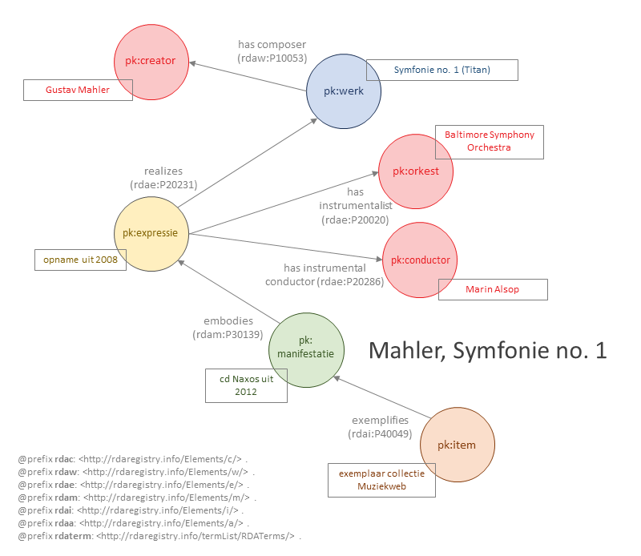

# Symfonie no. 1.

Bestand: [08_mahler-1.ttl](08_mahler-1.ttl)

## De bron

Een beschrijving van de in RDA beschreven bron, een cd met een opname van een symfonie van Gustav Mahler, is ook te vinden in [Discogs](https://www.discogs.com/release/8249413-Mahler-Baltimore-Symphony-Orchestra-Marin-Alsop-Symphony-No-1).

## Entiteitenstructuur

De ruggengraat van de beschrijving van de bron wordt gevorm door een rechttoe, rechtaan WEMI-structuur, met één werk (de symfonie), één expressie van dat werk (de uitvoering van de symfonie), één manifestatie van die expressie (de uitgegeven cd, en ook een specifiek item behorende tot die manifestatie.

Naast de WEMI-entiteiten zijn er vier actor-entiteiten, voor de componist, de dirigent, het orkest en de uitgever (niet allemaal weergegeven in onderstaande visualisatie).

## Representatie in RDA-RDF

Enige opmerkingen over de representatie in RDA-RDF.

### Het werk

Onmisbaar is hier `rdaw:P10004` (*category of work*), hier ingevuld met een RDAterm `rdaterm:1118` (*"muziekwerk"*). Deze aanduiding volstaat wellicht maar is erg algemeen. In praktijk zal het mogelijk de voorkeur verdienen om specifieker te zijn en een andere waardenlijst toe te passen. Kenmerk `rdaw:P10220` (*medium of performance*) biedt hier een belangrijke aanvulling.

### De identifiers

Bemerk dat identifiers doorgaans als een `blank node` opgenomen zijn, op één na nog zonder een geschikte waarde voor de *category of identifier*. Bij de actoren zijn de identifiers als literal opgenomen, zonder de mogelijkheid ze te karakteriseren.

### De expressie

Het essentiële element `rdae:P20001` (*content type*) geeft met waarde `rdaco:1011` aan dat het om *uitgevoerde muziek* gaat. Een muziekwerk zou bijvoorbeeld ook tot expressie kunnen komen als bladmuziek (`rdaco:1010`, *genoteerde muziek* ).

Zie bestand: [08_mahler-1.ttl](08_mahler-1.ttl)
