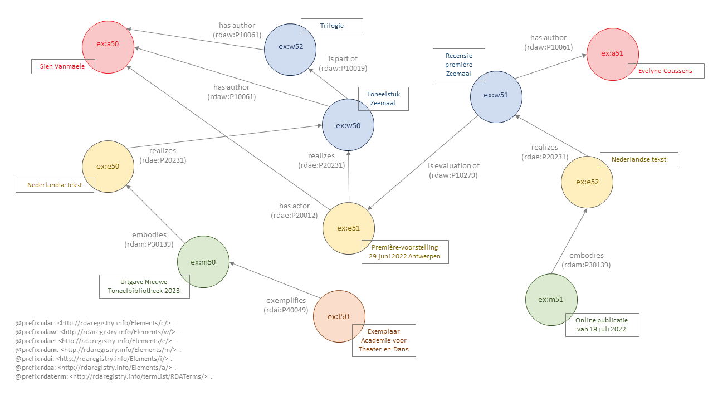

# Zeemaal

Bestand: [09_zeemaal.ttl](09_zeemaal.ttl)

## De bron

{ TODO }

## Entiteitenstructuur

{ TODO }

## Representatie in RDA-RDF

Enige opmerkingen over de representatie in RDA-RDF.

{ TODO} 

Zie bestand: [09_zeemaal.ttl](09_zeemaal.ttl)